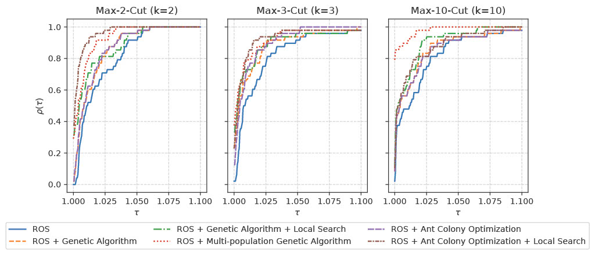

# Enhancing Max-*k*-Cut Solvers through Bio-Inspired Approaches

This repository contains the code for the paper **"Enhancing Max-*k*-Cut Solvers through Bio-Inspired Approaches"**, presented at the **BIOMAP 2026 Workshop** (BIO-inspired Methods for Pattern Recognition Track) of the **International Conference on Pattern Recognition (ICPR 2026)**.

## 📖 Overview

The **Max-*k*-Cut** problem is a fundamental NP-hard graph partitioning problem with applications in combinatorial optimization, network design, and machine learning. Recent advances have shown that learning-based approaches can efficiently generate high-quality candidate solutions, but additional optimization is often required to reach competitive objective values.

This work investigates a **hybrid optimization framework** that combines:

- **ROS (Relax-Optimize-and-Sample)**, a Graph Neural Network (GNN)-based Max-*k*-Cut solver,
- with **bio-inspired optimization techniques** acting as post-optimization refiners.

Starting from solutions generated by ROS, we evaluate several biologically inspired search strategies:

- **Genetic Algorithm (GA)**
- **Ant Colony Optimization (ACO)**
- **Multi-Species Genetic Algorithm (MGA)**

Hybrid variants further incorporate **local search** procedures to improve exploitation capabilities while preserving population diversity.

Experiments are conducted on the well-known **Gset benchmark suite** for:

k ∈ {2,3,10}

demonstrating the effectiveness of bio-inspired refinement for improving learning-based Max-*k*-Cut solutions.

## 🗂️ Repository Structure

.
├── ROS/                  # ROS framework and bio-inspired refiners
├── Gset/                 # Gset benchmark instances
├── install.sh            # Environment setup script
├── run_all_gset_*.sh     # Batch experiment scripts
└── README.md

## 🚀 Getting Started

### Prerequisites

- Python 3.10+
- PyTorch
- PyTorch Geometric

Additional dependencies:

ROS/requirements.txt  
ROS/environment.yml  

### Installation

bash install.sh

## ▶️ Running the Code

cd ROS

python main.py --alg ros_aco --graph_type gset --gset 1 --weight_mode 1 --k 2

## 📊 Methods

- ros_ga
- ros_ga_improved
- ros_aco
- ros_aco_only
- ros_mga

## 🙏 Acknowledgements

Based on ROS:
https://github.com/NetSysOpt/ROS

## 👥 Authors

Pietro De Angeli  
Giorgia Gabardi  
Alberto Vendramini  
Erik Nielsen  
Stefano Genetti  
Giovanni Iacca
